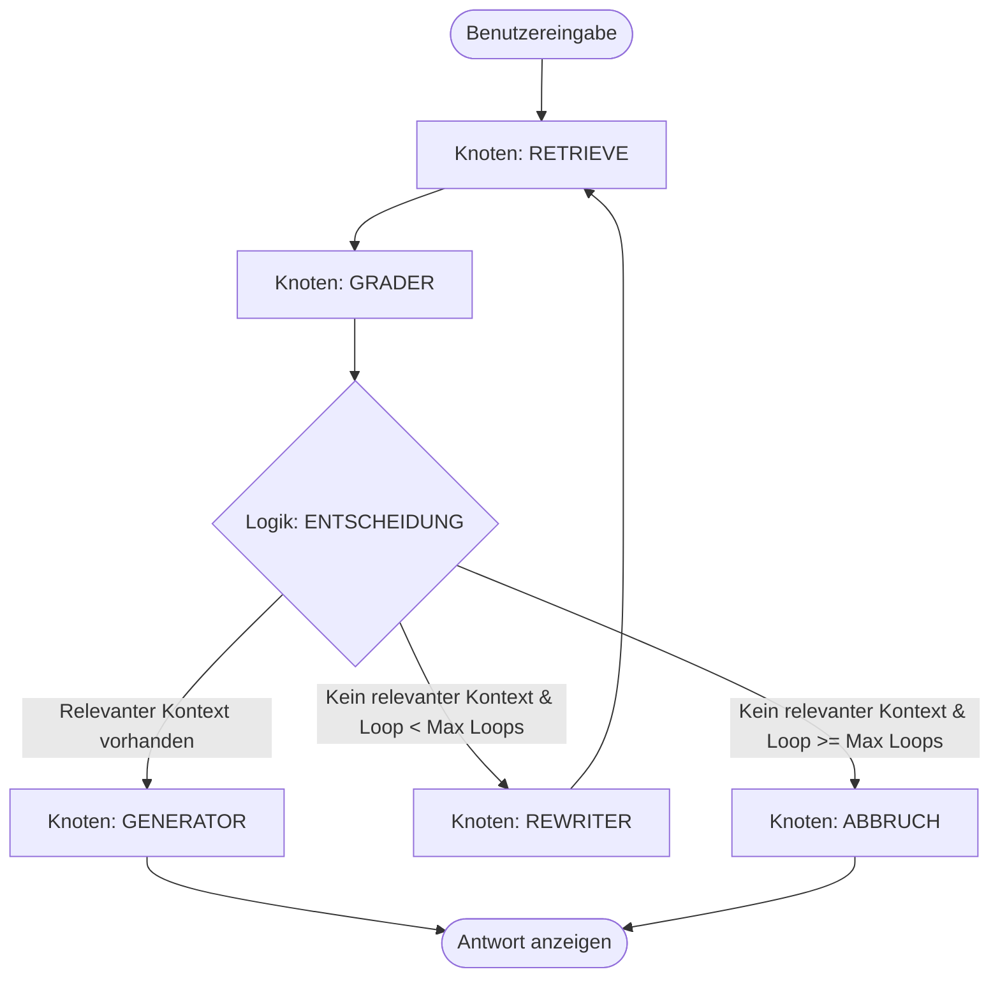

# LangGraph_Projekt

Projekt für kontextorientierten Zugriff auf Dokumente über LMM (RAG) mit einem agentischen Korrektur-Loop in LangGraph.

---

## 📋 Übersicht

Dieses Projekt implementiert ein lokales **Retrieval-Augmented Generation (RAG)** System mit einer intelligenten Korrekturschleife (**Corrective RAG / CRAG**). Anstatt sich blind auf die ersten Treffer einer Vektorsuche zu verlassen, bewertet ein LLM-basierter Grader die Relevanz der abgerufenen Dokumente. Sind diese nicht ausreichend, wird die Suchanfrage automatisch umformuliert (rewritten) und die Suche erneut durchgeführt.

Das System arbeitet vollständig lokal über **Ollama** und lokale **Sentence-Transformer-Embeddings**.

---

## 🛠️ Systemarchitektur

Das Projekt ist in folgende Hauptkomponenten unterteilt:

### 1. Zentrales Konfigurations-Management
* **`rag_config.json`**: Speichert alle globalen Einstellungen wie Pfade, Modellnamen, Chunks-Limits und Temperaturen zentral ab. Beide Pipeline-Skripte lesen diese Konfiguration dynamisch aus.
* **`cli.py`**: Ein interaktiver Manager für die Pipelines im Terminal. Erlaubt es, die Werte in der `rag_config.json` direkt über Menüs zu verändern und die Pipelines zu starten.

### 2. Ingestion-Pipeline (`1 - IngestionPipeline.py`)
Bereitet die Dokumente vor und speichert sie in der Vektordatenbank.
- **Konfigurations-Laden**: Liest Einstellungen aus der `rag_config.json` oder nutzt programminterne Fallbacks.
- **Laden & Bereinigen**: Liest `.pdf` und `.txt` Dateien aus dem konfigurierten Ordner (z. B. `meine_pdfs/`) ein und normalisiert Whitespaces.
- **Flexible Chunking-Methoden**:
  - *Semantisches Chunking*: Nutzt den `SemanticChunker`, um Texte anhand thematischer Sinnabschnitte zu unterteilen.
  - *Fixes Chunking*: Teilt den Text in feste Zeichenbereiche (basierend auf dem Token-Limit und der Überlappung) auf.
- **Einbettung (Embeddings)**: Vektorisiert die Textabschnitte mit dem konfigurierten Embedding-Modell (z. B. `all-MiniLM-L6-v2`).
- **Datenbank**: Speichert die Vektoren im konfigurierten Verzeichnis (z. B. `./chroma_db`).

### 3. Retrieval & Agenten-Pipeline (`2- SlopCreationPipeline.py`)
Führt eine interaktive Chat-Schleife (REPL) aus und steuert den Such- und Bewertungsprozess über einen **LangGraph**-Zustandsgraphen.



#### Knoten & Logik des Graphen:
* **`retrieve`**: Holt die $k$ ähnlichsten Text-Chunks aus der Vektordatenbank.
* **`grade_documents`**: Ein LLM bewertet jeden Chunk mit `ja` oder `nein` bezüglich der Relevanz für die Frage.
* **`decide_to_generate`**:
  * Wenn relevante Dokumente vorhanden sind: Weiter zu **`generate`**.
  * Wenn keine relevanten Dokumente vorhanden sind und das Limit (`max_rewrite_loops`) nicht erreicht ist: Weiter zu **`transform_query`**.
  * Wenn das Limit erreicht ist: Weiter zu **`abort_search`**.
* **`transform_query`**: Formuliert die Suchanfrage um, um bessere Suchergebnisse in der Vektordatenbank zu erzielen, und startet den Suchprozess erneut.
* **`generate`**: Generiert die finale Antwort basierend **ausschließlich** auf den als relevant bewerteten Chunks.
* **`abort_search`**: Gibt eine standardisierte Rückmeldung aus, falls auch nach maximalen Umformulierungen keine relevanten Dokumente gefunden wurden.

---

## 🚀 Installation & Setup

### Voraussetzungen
1. **Ollama**: Stelle sicher, dass [Ollama](https://ollama.com/) installiert ist und läuft. Lade das gewünschte LLM-Modell herunter (z. B. `gemma4:e4b` oder `llama3`):
   ```bash
   ollama run gemma4:e4b
   ```
2. **Dokumente**: Lege deine Quell-PDFs oder Textdateien in den konfigurierten Ordner (Standard: `./meine_pdfs`).

### Python-Abhängigkeiten
Installiere die benötigten Pakete:
```bash
pip install langchain langchain-community langchain-huggingface langchain-chroma langchain-experimental langgraph chromadb sentence-transformers pypdf
```

---

## 📖 Benutzung

Das Projekt kann nun komplett über den neuen Pipeline Manager gesteuert werden:

```bash
python cli.py
```

### Menüoptionen im Manager:
* **`[1] Ingestion Pipeline ausführen`**: Startet das Einlesen und Indexieren der Dokumente mit den aktuellen Einstellungen.
* **`[2] Slop Creation Pipeline ausführen`**: Startet den RAG-Chat-Agenten im Terminal.
* **`[3] Einstellungen`**: Ermöglicht die interaktive Konfiguration aller RAG-Parameter (z. B. Modelltyp, Chunking-Modus, Retrieval $k$, Temperatur). Die Änderungen werden automatisch in `rag_config.json` gespeichert.
